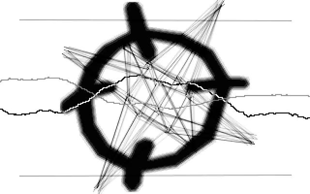
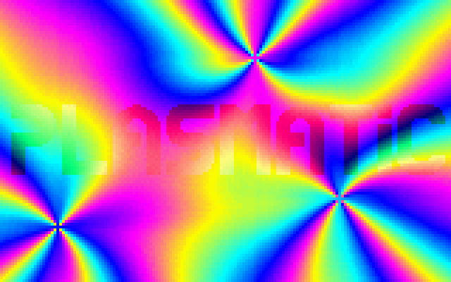

# Satori MS-DOS demos/intros sources releases
---
## Poison

**64KB Intro**

*Assembly sources + additional files (music module/bitmaps)*

**Poison Release Details**

* *original release*: https://files.scene.org/view/demos/groups/satori/poison.zip
* *release group*: **Zden & Moshe**
* *party*: 4th at The Party 1995 in 64K Intro competition
* *credits*:
code/graphics: **Zden**
code/music/graphics: **Moshe**

**Build Notes**

Use Borland Tasm to compile.

**More Public Links**

* https://demozoo.org/productions/7691
* https://www.youtube.com/watch?v=ZHJwiDoYwYk
* https://www.pouet.net/prod.php?which=782

intro release: December 1995
sources release: 2nd of April 2020

---
## Plasmatic

**4KB Intro**

*Assembly sources + side "tools" in C++*

**Plasmatic Release Details**

* *original release*: http://msg.sk/demos/archive/files/plasmat.zip
* *release group*: **Sunrise Software**
* *party*: 11th at Assembly party 1994 in 4K Intro competition
* *credits*:
code/graphics: **Zden**

**Build Notes**

Use Borland Tasm & Borland C++ to compile.

**More Public Links**

* https://archive.assembly.org/1994/pc-4k-intro/plasmatic-by-zden
* https://demozoo.org/productions/6826
* https://www.youtube.com/watch?v=pJ65514-huY
* https://www.pouet.net/prod.php?which=24739

intro release: 7th of August 1994
sources release: 14th of February 2020

---

http://satori.sk